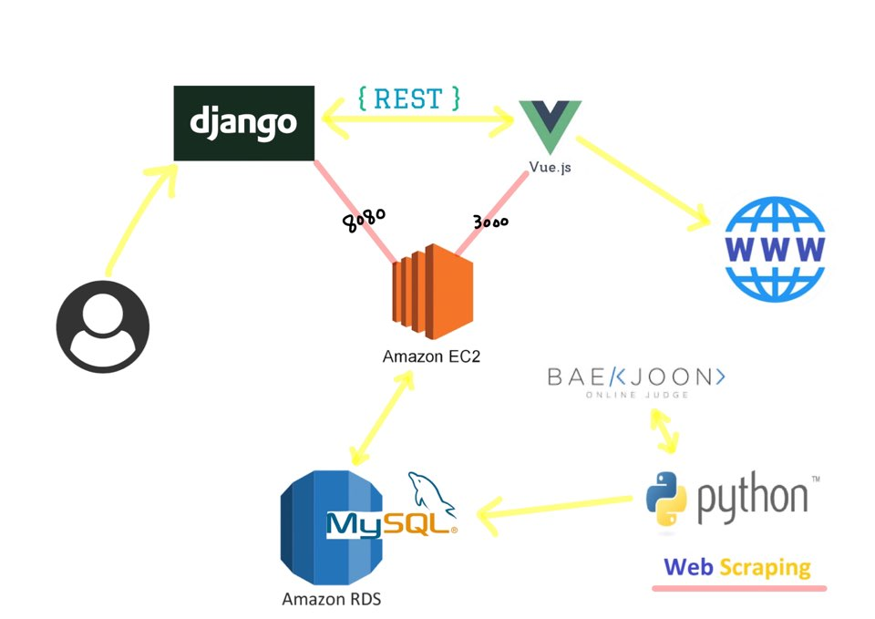

# AlgoReader - Server REST API

## 아키텍쳐




## api 소개

### Fight Code

| 메소드 | 경로                                   | 짦은 설명           |
| ------ | -------------------------------------- | ------------------- |
| GET    | /api/fightProblems/{userId1}/{userId2} | 두 계정 문제수 경쟁 |

#### 응답 바디 - 성공 

```json
HTTP 200 OK
Allow: GET, OPTIONS
Content-Type: application/json
Vary: Accept

{
    "winner": {
        "id": "wony6731",
        "problemCount": 76
    },
    "loser": {
        "id": "mor2222",
        "problemCount": 17
    }
}
```

#### 응답 바디 - 잘못된 유저 

```json
HTTP 200 OK
Allow: OPTIONS, GET
Content-Type: application/json
Vary: Accept

{
    "winner": {
        "id": "",
        "problemCount": ""
    },
    "loser": {
        "id": "",
        "problemCount": ""
    }
}
```

> exception 처리 할 시간이 부족해서 frontend logic에 맞게 ok response return


### getSolvedProblems

| 메소드 | 경로                              | 짦은 설명                |
| ------ | --------------------------------- | ------------------------ |
| GET    | /api/solvedProblems/list/{userId} | 유저별 문제 분석 및 추천 |

#### 응답 바디 - 성공 

```json
HTTP 200 OK
Allow: OPTIONS, GET
Content-Type: application/json
Vary: Accept

{
    "ranking": "38031",
    "solving_count": "17",
    "soling_problems": [
        {
            "problemNum": 1260,
            "problemName": "DFS와 BFS",
            "category": "BFS",
            "answerRate": 2956
        },
       	...
    ],
    "top5_list": [
        {
            "problemNum": 1118,
            "problemName": "색칠 2",
            "category": "기하 알고리즘",
            "answerRate": 4444
        },
       ...
    ]
}
```

#### 응답 바디 - 잘못된 유저 

```json
HTTP 200 OK
Allow: GET, OPTIONS
Content-Type: application/json
Vary: Accept

{
    "ranking": "0",
    "solving_count": "0",
    "soling_problems": [],
    "top5_list": []
}
```

> exception 처리 할 시간이 부족해서 frontend logic에 맞게 ok response return


### 기록용 목차

requirement.txt
필요한 라이브러리(ipython, django 등)를 설치하여 개발환경 세팅 후 requirements.txt를 만든다.
requirements.txt가 있다면 다음 명령을 통해 동일한 파이썬 패키지들을 한번에 설치할 수 있다.

```shell
$ pip3 freeze > requirements.txt  # 패키지 목록을 txt 파일로 만들기
$ pip3 install -r requirements.txt  # 한번에 패키지 설치
```